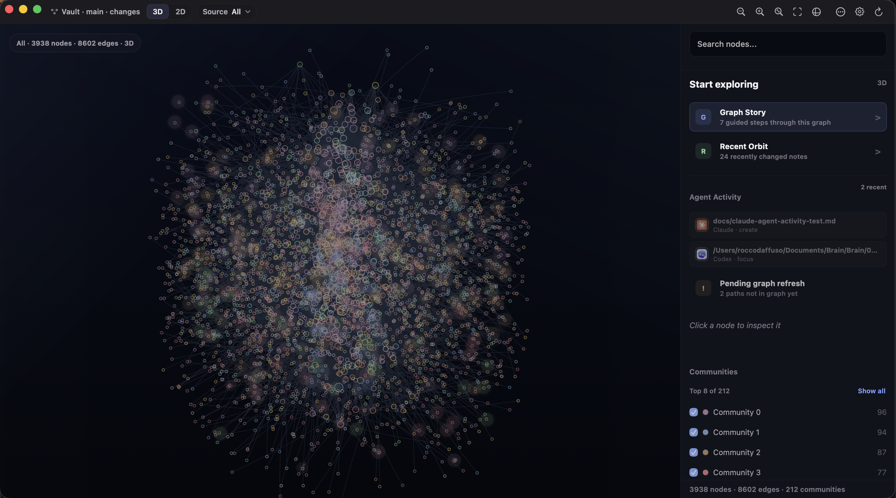
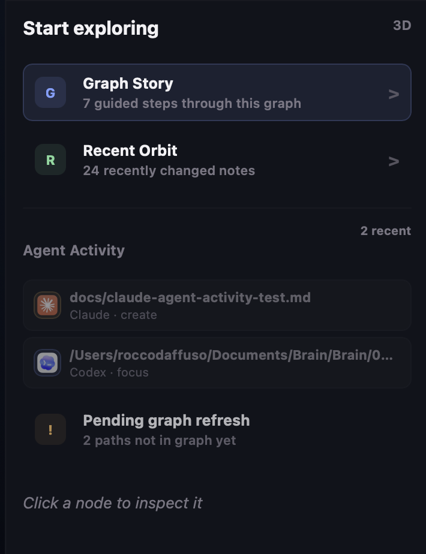

# BrainBar

> A local-first macOS app for exploring Graphify-powered Markdown graphs.

[](https://github.com/Nova1390/brain-bar/releases/latest)
[](https://www.apple.com/macos/)
[](https://developer.apple.com/xcode/swiftui/)
[](https://github.com/safishamsi/graphify)
[](LICENSE)

BrainBar turns local Graphify output into a native macOS workspace for navigating a second brain or any Graphify-compatible Markdown knowledge graph. Search a note, reveal it in 3D, focus its neighborhood, trace why two ideas connect, and watch local agent activity appear on the graph.

BrainBar is not a raw Markdown graph generator. It expects Graphify to generate `graphify-out/graph.json` first, then makes that graph useful as an interactive operating surface.


## What BrainBar Does

BrainBar reads existing Graphify output from a configured local vault or content folder:

```text
graphify-out/
|-- graph.html
|-- graph.json
`-- GRAPH_REPORT.md
```

It does not vendor Graphify, upload vault content, rewrite generated Graphify files, or write to the vault from graph exploration features. The 3D and 2D graph modes are runtime-only views over local data.

## What Is In v0.9.81

- **3D Explorer by default.** Search Reveal, Focus Orbit, Shortest Path, Explain Path, Path Compare, Community Spotlight, Recent Orbit, Graph Story, and Living Graph polish.
- **Agent Activity.** Local file activity plus metadata-only `brainbar-trace` events, with one-click Codex and Claude integrations.
- **3D performance recovery.** Smooth drag and zoom on dense graphs by removing invisible render work and keeping only low-cost static/reactive living signals.
- **2D Workbench.** Operational graph inspection for recent notes, key notes, needs-links notes, groups, edge provenance, Graph Check, and bridge actions into 3D.
- **Premium macOS surface.** Flatter app chrome, quieter sidebars, updated BrainBar mark, and a more native Settings layout.
- **Notarized releases.** Public GitHub Releases ship as Developer ID signed, Apple-notarized `BrainBar.dmg` files.

See [CHANGELOG.md](CHANGELOG.md) for the full release history.

## Install

```sh
curl -fsSL https://raw.githubusercontent.com/Nova1390/brain-bar/main/install.sh | bash
```

The installer downloads the latest GitHub Release DMG, installs `BrainBar.app` into `~/Applications`, and preserves existing local config.

To prefill the vault path on first install:

```sh
BRAIN_BAR_VAULT_PATH="/path/to/your/vault" curl -fsSL https://raw.githubusercontent.com/Nova1390/brain-bar/main/install.sh | bash
```

To replace an existing install non-interactively:

```sh
BRAIN_BAR_FORCE=1 curl -fsSL https://raw.githubusercontent.com/Nova1390/brain-bar/main/install.sh | bash
```

## First Run

1. Install or update [Graphify](https://github.com/safishamsi/graphify).
2. Generate Graphify output for your local Markdown vault.
3. Confirm `graphify-out/graph.json` exists inside the configured vault.
4. Open BrainBar and set the vault path in Settings, or pass `BRAIN_BAR_VAULT_PATH` during install.
5. Use Refresh Graph if the graph output is stale.
6. Open the graph window and start in 3D.

## The Core Loop

1. **Reveal.** Search for a note and jump to it without collapsing the graph.
2. **Focus.** Use Focus Orbit and depth controls to read its visible neighborhood.
3. **Trace.** Start a path from one note, click another note or search result, and BrainBar highlights the shortest visible route.
4. **Understand.** Read `Why this path`, compare route variants, or switch Source Lens between All, Graphify, and Wikilinks.
5. **Re-enter.** Use Recent Orbit or Graph Story to resume from recent changes and orient yourself in the current graph.


## Agent Activity

Agent Activity shows what local tools and agents are touching in your graph. BrainBar watches recent local file activity and can also read metadata-only JSONL events from the bundled `brainbar-trace` helper.

The v0.9.81 integration includes one-click installers for Codex and Claude. When enabled, supported agents can emit events such as `read`, `write`, `create`, `delete`, `focus`, `closeout`, and `decision`. BrainBar maps those paths back to graph nodes when possible and shows pending paths when the graph has not been refreshed yet.



The event contract is deliberately narrow:

- metadata only: agent, action, path, timestamp, optional reason/status
- no note contents, prompts, raw transcripts, stdout/stderr, secrets, or build artifacts
- local log only, stored under `~/Library/Application Support/BrainBar/`
- automatic retention keeps the log bounded



## 3D Explorer

The 3D Explorer is BrainBar's main surface. It keeps the graph spatially present while making one route, node, community, or recent change readable.

- **Search Reveal** jumps to visible matching notes and highlights local neighbors.
- **Focus Orbit** centers a selected note and expands visible context by depth.
- **Shortest Path** traces the shortest visible unweighted route between two notes.
- **Explain Path** summarizes visible graph metadata behind a route without AI calls.
- **Path Compare** shows alternative deterministic route variants when they exist.
- **Community Spotlight** inspects one visible community without losing global context.
- **Recent Orbit** highlights recently changed notes and traces one active recent note to a nearby key note.
- **Graph Story** gives a guided deterministic tour through recent changes, key notes, communities, bridge notes, and needs-attention areas.


## 2D Workbench

2D is the operational workbench for inspection and graph hygiene. It embeds the generated Graphify/vis-network graph and adds BrainBar runtime controls without rewriting `graphify-out/graph.html`.

Use it for:

- recent notes, key notes, needs-links notes, groups, and Graph Check
- Source Lens inspection across All, Graphify, and Wikilinks
- edge provenance and source/target inspection
- community detail and bridge notes
- bridge actions such as Reveal in 3D and Path from here in 3D

## Source Lens

Source Lens filters edge provenance in the current graph view:

- `All`: show all visible graph relationships
- `Graphify`: show generated Graphify relationships
- `Wikilinks`: show wikilinks exported by Graphify metadata

The internal compatibility raw value for Wikilinks is still `obsidian`; the public label is `Wikilinks`.

## Local Workflow Hooks

BrainBar can run configured local commands, but it does not define or own those workflows:

- Refresh Graphify output.
- Open Graphify report files.
- Show System Status for vault path, graph file, Graphify command, Git state, Review Queue, and Brain Check.
- Run an optional Brain Check command.
- Show an optional Review Queue status command and run an explicit manual action.

Review Queue is generic and local. The background watcher is off by default and only checks status.

## Configuration

Default config path:

```text
~/Library/Application Support/BrainBar/config.json
```

Installer variables:

- `BRAIN_BAR_VAULT_PATH`: prefill the configured local vault path.
- `BRAIN_BAR_FORCE=1`: replace an existing install non-interactively.
- `BRAIN_BAR_INSTALL_DIR`: override the install directory, defaulting to `~/Applications`.

Development and tests can override the config path:

```sh
BRAIN_BAR_CONFIG=/tmp/brainbar-config.json open ~/Applications/BrainBar.app
```

See [Configuration](docs/configuration.md) for the full config shape and command behavior.

## Requirements

For users:

- macOS 14 or newer
- Graphify output in the configured vault
- `graphify` available on `PATH` for the default refresh command, or a custom refresh command in config
- `git` on `PATH` if you want vault Git status

For development:

- Xcode 26 or newer
- Node.js for graph runtime smoke tests

## Development

```sh
xcodebuild -project BrainBar.xcodeproj -scheme BrainBar -destination 'platform=macOS' build
xcodebuild test -project BrainBar.xcodeproj -scheme BrainBar -destination 'platform=macOS' CODE_SIGNING_ALLOWED=NO
node scripts/test-graph-runtime.mjs
scripts/check-public-safety.sh
```

Before changing product vocabulary or graph architecture terms, read [CONCEPTS.md](CONCEPTS.md).

## Release

Maintainer release tags publish a notarized `BrainBar.dmg` through GitHub Actions:

```sh
git tag -a vX.Y.Z -m "BrainBar vX.Y.Z"
git push origin vX.Y.Z
```

The release workflow runs public safety checks, graph runtime checks, Xcode tests, Developer ID signing, Apple notarization, stapling, DMG creation, and mounted-app validation before uploading the asset. Required and optional signing secrets are documented in [RELEASING.md](RELEASING.md).

After publication, maintainers can run the clean-runner verification workflow:

```sh
gh workflow run verify-release-dmg.yml --ref main -f tag=vX.Y.Z
```

## Update

Run the installer again. Existing config is preserved.

```sh
BRAIN_BAR_FORCE=1 curl -fsSL https://raw.githubusercontent.com/Nova1390/brain-bar/main/install.sh | bash
```

## Uninstall

```sh
curl -fsSL https://raw.githubusercontent.com/Nova1390/brain-bar/main/uninstall.sh | bash
```

To remove local config too:

```sh
BRAIN_BAR_REMOVE_CONFIG=1 curl -fsSL https://raw.githubusercontent.com/Nova1390/brain-bar/main/uninstall.sh | bash
```

## Troubleshooting

- **The graph is empty.** Check that `vaultPath` points at the intended vault and that `graphify-out/graph.json` exists there.
- **Refresh Graph fails.** Make sure `graphify` is available on `PATH`, or update the configured refresh command.
- **Search finds nothing.** Search Reveal only searches nodes visible under the current Source Lens and community filters.
- **No path found.** The selected nodes may be disconnected in the visible graph, or the active Source Lens/community filters may hide the route.
- **Recent Orbit is empty.** BrainBar needs file modification metadata or date-like labels/paths to identify recent notes.
- **Agent Activity shows pending paths.** Refresh Graph after creating new files so Graphify can add them to `graph.json`.
- **Codex or Claude events do not appear.** Enable Agent Activity in Settings, install the integration, and confirm the agent is using `brainbar-trace`.
- **macOS blocks the app.** Install the latest notarized DMG release instead of an older non-notarized build.

## Privacy

BrainBar is local-first:

- It reads local graph output and configured local source files.
- It opens local notes through macOS.
- It runs local commands that you configure.
- It does not upload vault content.
- It does not write to the vault from graph exploration features.
- It does not call remote AI services.
- Agent Activity stores metadata-only local events and never note contents.

## License

MIT. See [LICENSE](LICENSE).
