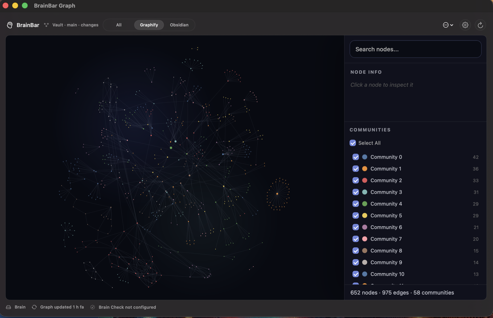
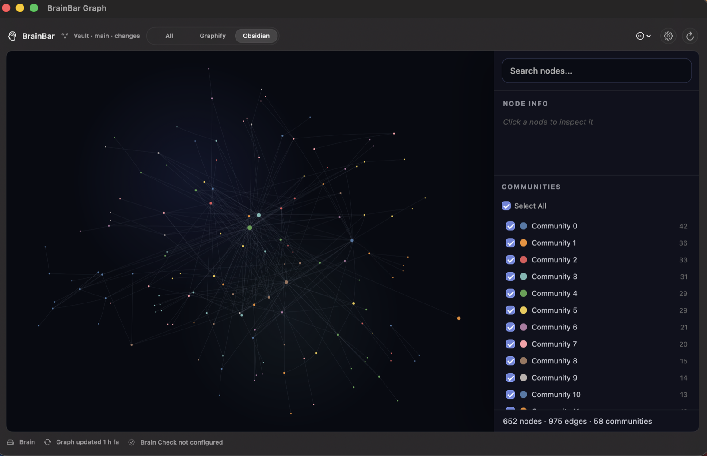
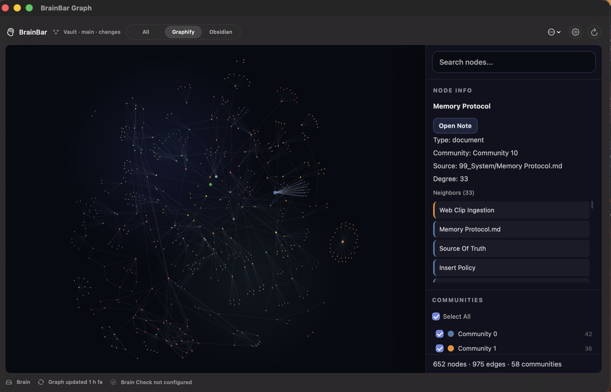

# BrainBar

> Your local vault graph, one click away.

[](https://github.com/Nova1390/brain-bar/releases/latest)
[](https://www.apple.com/macos/)
[](https://developer.apple.com/xcode/swiftui/)
[](https://github.com/safishamsi/graphify)
[](LICENSE)


BrainBar is a native macOS menu bar control surface for a local-first Markdown or Obsidian vault powered by [Graphify](https://github.com/safishamsi/graphify).

It keeps the graph where it belongs: on your machine, inside a compact menu bar app, with direct access to refresh, inspect, open, and validate your vault workflow.

## Why

- **See the graph immediately.** Click the menu bar icon and inspect `graphify-out/graph.html` inside BrainBar, without bouncing to a browser.
- **Stay local-first.** BrainBar runs local commands, opens local files, and never uploads vault contents.
- **Keep the workflow generic.** Vault paths, Graphify commands, dashboards, reports, and check scripts live in local config, not in the public repo.
- **Use it as a control panel.** Refresh Graphify, open the vault, inspect Git state, run custom checks, and jump into a larger Focus Window when the graph needs room.

## Highlights

- Native SwiftUI macOS menu bar app with `MenuBarExtra`
- Embedded WebKit graph view for `graphify-out/graph.html`
- Runtime graph skin that does not rewrite Graphify output
- Focus Window for longer graph exploration
- Experimental 3D Focus Graph mode for spatial exploration in the Focus Window
- Source lens for switching between all edges, generated Graphify relationships, and native Obsidian wikilinks
- Node inspection with an Open Note action for jumping from graph node to local source file
- Graphify refresh from the footer or action menu
- Vault, Git branch/dirty state, Graphify, and brain-check status
- Configurable vault path, dashboard path, report path, server port, and commands
- Optional Obsidian URL scheme support
- Optional local HTTP server bound to `127.0.0.1`
- Optional macOS notifications after long-running commands finish

## Product Tour

### Focus Window

BrainBar can expand from the menu bar into a larger native Focus Window for longer graph exploration, while keeping refresh, settings, and action controls close at hand.


### Source Lens

Switch between the full graph, generated Graphify relationships, and native Obsidian wikilinks without modifying the generated Graphify HTML on disk.

| Graphify relationships | Obsidian wikilinks |
| --- | --- |
|  |  |

### Node Navigation

Select a graph node to inspect its metadata, then open the backing local note or source file directly from BrainBar.



## Graphify

BrainBar is a companion app for [Graphify](https://github.com/safishamsi/graphify), an open-source tool that turns folders of code, docs, notes, papers, and other inputs into a navigable knowledge graph.

Graphify writes the files BrainBar expects by default:

```text
graphify-out/
├── graph.html
├── graph.json
└── GRAPH_REPORT.md
```

BrainBar does not vendor, fork, or modify Graphify. It runs the configured local `graphify` command and embeds the generated `graph.html` file.

## Install

```sh
curl -fsSL https://raw.githubusercontent.com/Nova1390/brain-bar/main/install.sh | bash
```

The installer downloads the latest GitHub Release, installs `BrainBar.app` into `~/Applications`, and creates local config only if it is missing.

To prefill the vault path on first install:

```sh
BRAIN_BAR_VAULT_PATH="/path/to/your/vault" curl -fsSL https://raw.githubusercontent.com/Nova1390/brain-bar/main/install.sh | bash
```

To install elsewhere:

```sh
BRAIN_BAR_INSTALL_DIR=/Applications curl -fsSL https://raw.githubusercontent.com/Nova1390/brain-bar/main/install.sh | bash
```

v1 releases are ad-hoc signed but not notarized. On first launch, macOS may block the app until you approve it manually:

1. Try to open BrainBar once.
2. If macOS blocks it, open System Settings > Privacy & Security.
3. In the Security section, choose Open Anyway for BrainBar.
4. If the app does not appear there, right-click BrainBar in Finder and choose Open.

## Requirements

- macOS 14 or newer
- Xcode 26 or newer for local development
- `git` available on `PATH`
- `graphify` available on `PATH` if you use the default refresh command

## Update

Run the installer again. If an app already exists, the script asks before replacing it. For non-interactive replacement:

```sh
BRAIN_BAR_FORCE=1 curl -fsSL https://raw.githubusercontent.com/Nova1390/brain-bar/main/install.sh | bash
```

Your local config is preserved.

## Uninstall

```sh
curl -fsSL https://raw.githubusercontent.com/Nova1390/brain-bar/main/uninstall.sh | bash
```

By default, uninstall keeps local configuration. To remove it too:

```sh
BRAIN_BAR_REMOVE_CONFIG=1 curl -fsSL https://raw.githubusercontent.com/Nova1390/brain-bar/main/uninstall.sh | bash
```

## Configuration

Default config path:

```text
~/Library/Application Support/BrainBar/config.json
```

Development and tests can override the config path:

```sh
BRAIN_BAR_CONFIG=/tmp/brainbar-config.json open ~/Applications/BrainBar.app
```

Default schema:

```json
{
  "commands": {
    "brainCheck": null,
    "refreshGraph": {
      "arguments": ["update", "."],
      "executable": "graphify",
      "workingDirectory": "vault"
    }
  },
  "graphHtmlRelativePath": "graphify-out/graph.html",
  "graphReportRelativePath": "graphify-out/GRAPH_REPORT.md",
  "notificationsEnabled": false,
  "projectDashboardRelativePath": "Project Dashboard.md",
  "serverPort": 8765,
  "useObsidianURLScheme": false,
  "vaultPath": ""
}
```

`workingDirectory: "vault"` means the command runs inside the configured vault directory. Commands are executed with `Process`, not through a shell.

## Graph View

BrainBar expects a generated Graphify HTML file at:

```text
graphify-out/graph.html
```

If the file exists, BrainBar embeds it directly in the menu bar popover and Focus Window. If no refresh has run in the current app session, BrainBar uses the file modification date and shows a status such as `Graph updated 2 min. ago`.

The footer Graphify status is also a refresh button. Click it to run the configured `refreshGraph` command. During refresh, BrainBar shows `Refreshing Graph...`; if the command succeeds, the embedded graph reloads.

Use the source lens to switch between all graph edges, Graphify-generated relationships, and Obsidian wikilinks. The lens is session-only and does not change local config or rewrite generated files.

Select a node to inspect it. If the generated graph includes a source file for that node, BrainBar shows an Open Note action and supports double-clicking the node to open the backing local file. Source paths are resolved inside the configured vault before opening.

The visual styling is applied at runtime by BrainBar through WebKit. The original `graphify-out/graph.html` file is not rewritten.

## Focus Window

Use the Focus Window toolbar button to open a larger resizable graph window. It shares the same configuration and state as the menu bar popover, but gives the graph more room for inspection.

The Focus Window also includes an experimental `2D / 3D Beta` view switch. `2D` keeps the standard embedded Graphify view. `3D Beta` opens a BrainBar-owned Canvas renderer with controlled depth projection, zoom, fit, top view, reset tilt, Source Lens filtering, node inspection, and Open Note support.

The 3D renderer is bundled locally and does not use a CDN. It reads the same local `graph.json` metadata as the 2D Source Lens, and it does not rewrite Graphify output files. See [Experimental 3D Focus Graph](docs/experimental-3d-focus-graph.md) for architecture notes and stability criteria.

Settings can be opened from either the popover or Focus Window. BrainBar brings the Settings window to the front so it does not get hidden behind the graph window.

## Brain Check Commands

BrainBar does not include a built-in definition of "brain check". Instead, it exposes a local command hook that you can point at any script or CLI that validates your own vault.

The default public config leaves it disabled:

```json
"brainCheck": null
```

When it is disabled, the app shows `Brain Check Not Configured`. That is not an error; it means BrainBar is waiting for you to define what a check means for your setup.

Brain check commands always run with the vault as their working directory. This keeps the repo generic and lets each user wire their own private workflow without hardcoding paths or vault-specific scripts into BrainBar.

Examples:

| Use case | Brain check executable | Brain check arguments |
| --- | --- | --- |
| Run a Python script inside the vault | `python3` | `scripts/brain_check.py` |
| Run a shell script inside the vault | `bash` | `scripts/brain_check.sh` |
| Run an executable script in the vault | `./scripts/brain_check` | |
| Run a custom installed CLI | `brain-check` | `--strict .` |

If your terminal command is:

```sh
python3 scripts/brain_check.py --strict
```

configure BrainBar like this:

```text
Brain check executable: python3
Brain check arguments: scripts/brain_check.py --strict
```

Because BrainBar uses `Process` directly rather than a shell, shell-only syntax such as pipes, redirects, aliases, and inline environment variables is not interpreted. Put that logic in a script, then configure BrainBar to run the script.

## Local Server

The embedded graph view does not need the local server. The server is available from Actions > Advanced for workflows that need an HTTP URL instead of a local file URL, for example:

```text
http://127.0.0.1:8765/graphify-out/graph.html
```

BrainBar starts the server with Python's built-in `http.server`, bound to `127.0.0.1`. It is intended for local fallback/debug use, not cloud publishing.

## Development

Project history is tracked in [CHANGELOG.md](CHANGELOG.md).

Build:

```sh
xcodebuild -project BrainBar.xcodeproj -scheme BrainBar -destination 'platform=macOS' build
```

Test:

```sh
xcodebuild test -project BrainBar.xcodeproj -scheme BrainBar -destination 'platform=macOS' CODE_SIGNING_ALLOWED=NO
```

Package a release zip:

```sh
scripts/package-release.sh
```

Run the public-safety check:

```sh
scripts/check-public-safety.sh
```

## Release

1. Update `MARKETING_VERSION` in the Xcode project.
2. Run tests and `scripts/check-public-safety.sh`.
3. Tag the release:

   ```sh
   git tag v0.2.0
   git push origin v0.2.0
   ```

4. GitHub Actions builds `BrainBar.zip` and attaches it to the release.

The expected release asset name is:

```text
BrainBar.zip
```

The installer downloads this asset from the latest GitHub Release.

## Homebrew Roadmap

The preferred v1 distribution is the simple release installer above. A later release can add a Homebrew cask in a tap such as `Nova1390/homebrew-tap`:

```ruby
cask "brain-bar" do
  version "0.2.0"
  sha256 "<release zip sha256>"
  url "https://github.com/Nova1390/brain-bar/releases/download/v#{version}/BrainBar.zip"
  name "BrainBar"
  desc "Native macOS menu bar control panel for local-first vault workflows"
  homepage "https://github.com/Nova1390/brain-bar"
  app "BrainBar.app"
end
```

## Signing And Notarization

v1 ships ad-hoc signed and not notarized, with manual approval documented above. A production-ready release should add:

- Developer ID Application signing
- `xcrun notarytool` submission in GitHub Actions
- `xcrun stapler staple` before packaging
- GitHub secrets for Apple signing credentials

## Privacy

BrainBar is local-first. It opens local files, runs local commands, and can serve the graph HTML on `127.0.0.1`. It does not send vault contents to any cloud service.
