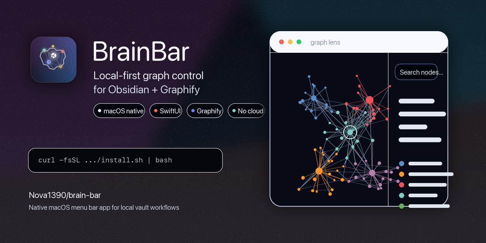
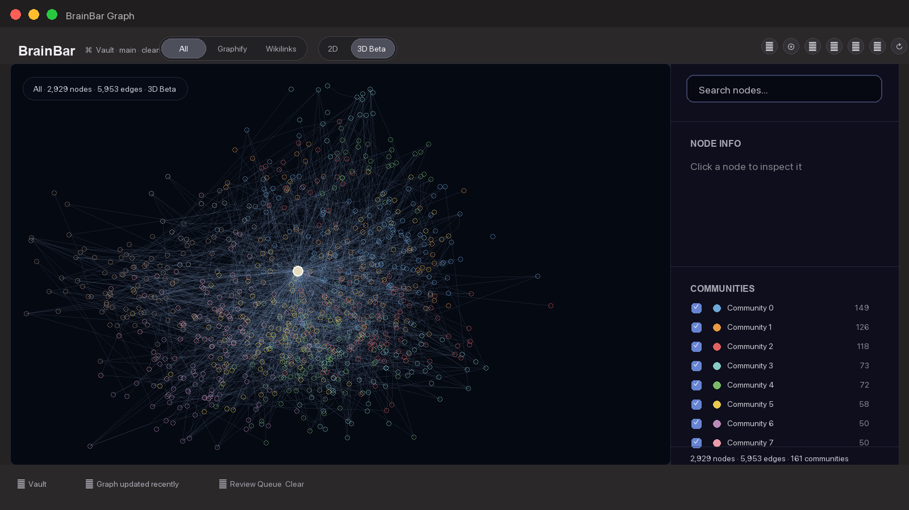

# BrainBar

> A local-first macOS graph explorer and workflow control center for Markdown, Obsidian-style vaults, and Graphify output.

[](https://github.com/Nova1390/brain-bar/releases/latest)
[](https://www.apple.com/macos/)
[](https://developer.apple.com/xcode/swiftui/)
[](https://github.com/safishamsi/graphify)
[](LICENSE)



BrainBar turns a local Graphify knowledge graph into a native macOS control surface. It helps you open the graph, inspect notes, trace connections, resume recent context, and run local checks without uploading vault content or rewriting generated graph files.

It is built for people who already keep useful things in local Markdown and want the graph to become an operating surface, not just a pretty hairball.

## Install

```sh
curl -fsSL https://raw.githubusercontent.com/Nova1390/brain-bar/main/install.sh | bash
```

The installer downloads the latest GitHub Release DMG, installs `BrainBar.app` into `~/Applications`, and preserves existing local config.

To prefill the vault path on first install:

```sh
BRAIN_BAR_VAULT_PATH="/path/to/your/vault" curl -fsSL https://raw.githubusercontent.com/Nova1390/brain-bar/main/install.sh | bash
```

To replace an existing install non-interactively:

```sh
BRAIN_BAR_FORCE=1 curl -fsSL https://raw.githubusercontent.com/Nova1390/brain-bar/main/install.sh | bash
```

Public releases from `v0.9.3` onward are Developer ID signed, Apple-notarized, stapled, packaged as `BrainBar.dmg`, and verified on a clean GitHub-hosted macOS runner.

## The Wow Loop

1. Open BrainBar from the menu bar.
2. Switch to the 3D Explorer.
3. Click a note and use Focus to understand its neighborhood.
4. Start a path from one note, click another note, and BrainBar traces the visible route.
5. Read Why this path or compare route variants.
6. Use Recent Orbit or Graph Story to re-enter the graph from what changed recently.


## Why BrainBar

- **Explore locally.** BrainBar reads local Graphify output and local source files. It does not upload vault content.
- **Open source notes fast.** Select a graph node, inspect its metadata, and open the backing file from the app.
- **Turn paths into context.** Shortest Path, Explain Path, and Path Compare make connections easier to inspect.
- **Recover recent work.** Daily/Recent Orbit highlights recently changed notes and traces them back toward key notes.
- **Understand the whole graph in steps.** Graph Story creates a deterministic tour through recent notes, key notes, communities, bridge notes, and areas that may need links.
- **Keep diagnostics separate.** 2D stays available for operational graph views such as Needs Links, Key Notes, Recent, Wikilinks, Graphify, and Graph Check.

## 3D Explorer

The 3D Explorer is BrainBar's main human exploration surface. It uses the same local graph metadata as the 2D view, but renders through BrainBar-owned bundled 3D resources.



### Focus Orbit

Click a note, then use `Focus`, `Depth 1`, `Depth 2`, or `Depth 3` to keep the selected note readable while surrounding context fades back. The sidebar shows the selected note, source path, degree, and top neighbors instead of an infinite wall of links.

### Shortest Path

Click a node, choose `Start path`, then click another node. BrainBar calculates the shortest visible unweighted path using the current Source Lens and community filters.

Path mode highlights the path, dims surrounding graph context, labels the route, and keeps ordered steps clickable in the sidebar.

### Explain Path

Under the path steps, BrainBar adds a deterministic `Why this path` explanation. It uses only visible graph metadata:

- Wikilink vs Graphify provenance
- communities crossed
- strongest bridge note in the route
- available edge labels
- conservative caveats when metadata is sparse

No AI, network call, or vault write is involved.

### Path Compare

When alternative routes exist, Path Compare can switch the same source and target between:

- `Shortest visible`
- `Different route`
- `Best explained`
- `Wikilinks only`
- `Graphify only`

If a variant is unavailable in the current view, BrainBar says so instead of pretending every pair has every kind of path.

### Community Spotlight

Click a community to dim the rest of the graph, show the selected community, list top notes, and surface bridge notes that connect it to surrounding areas. Large communities use conservative render budgets so the spotlight stays responsive.

### Daily/Recent Orbit

Recent Orbit answers: "What changed recently?"

It highlights recent notes using file modification metadata when available, falls back to date-like labels or paths, and traces one active recent note to its nearest visible key note.

### Graph Story

Graph Story is a guided, deterministic tour through the current visible graph:

- Recently changed notes
- Your most connected notes
- Largest visible communities
- Notes connecting communities
- Areas that may need links

The tour adapts to the current Source Lens and community filters. Empty categories are skipped.

## 2D Operational Graph

2D is the stable embedded Graphify view. BrainBar injects runtime JS/CSS to add a calmer skin and workflow controls without rewriting `graphify-out/graph.html`.


The 2D toolbar focuses on operational views:

- `All`
- `Needs Links`
- `Key Notes`
- `Recent`
- `Wikilinks`
- `Graphify`
- `Graph Check`

When Review Queue items expose `source_file` or `node_id`, a `Review` view can highlight them in the graph. If there are no graph-targeted review items, the button stays hidden.


## Source Lens

Source Lens filters edge provenance in the current graph view:

- `All`: show all visible graph relationships
- `Graphify`: show generated Graphify relationships
- `Wikilinks`: show wikilinks exported by Graphify metadata

The internal compatibility raw value for Wikilinks is still `obsidian`; the public label is `Wikilinks`.


## Local Workflow Control

BrainBar can also act as a small local command surface:

- Refresh Graphify output.
- Open Graphify report files.
- Show System Status for vault path, graph file, Graphify command, Git state, Review Queue, and Brain Check.
- Run an optional Brain Check command.
- Show an optional Review Queue status command.

Review Queue is deliberately generic. BrainBar reads a configured local JSON status command and can run an explicit manual action when clicked. The background watcher is off by default and only checks status.

## Graphify

BrainBar expects Graphify output in the configured vault:

```text
graphify-out/
|-- graph.html
|-- graph.json
`-- GRAPH_REPORT.md
```

BrainBar does not vendor, fork, or modify Graphify. It runs the configured local refresh command and embeds the generated files.

## Configuration

Default config path:

```text
~/Library/Application Support/BrainBar/config.json
```

Development and tests can override it:

```sh
BRAIN_BAR_CONFIG=/tmp/brainbar-config.json open ~/Applications/BrainBar.app
```

Default shape:

```json
{
  "commands": {
    "brainCheck": null,
    "refreshGraph": {
      "arguments": ["update", "."],
      "executable": "graphify",
      "workingDirectory": "vault"
    }
  },
  "graphHtmlRelativePath": "graphify-out/graph.html",
  "graphReportRelativePath": "graphify-out/GRAPH_REPORT.md",
  "notificationsEnabled": false,
  "projectDashboardRelativePath": "Project Dashboard.md",
  "reviewQueue": {
    "backgroundWatcherEnabled": false,
    "isEnabled": false,
    "manualCommand": null,
    "preflightCommand": null,
    "timeoutSeconds": 10,
    "watcherIntervalSeconds": 300
  },
  "serverPort": 8765,
  "useObsidianURLScheme": false,
  "vaultPath": ""
}
```

`workingDirectory: "vault"` runs the command inside the configured vault. Commands are executed with `Process`, not through a shell.

## Requirements

- macOS 14 or newer
- `graphify` available on `PATH` for the default refresh command
- `git` available on `PATH` for Git status
- Xcode 26 or newer for local development

## Development

```sh
xcodebuild -project BrainBar.xcodeproj -scheme BrainBar -destination 'platform=macOS' build
xcodebuild test -project BrainBar.xcodeproj -scheme BrainBar -destination 'platform=macOS' CODE_SIGNING_ALLOWED=NO
node scripts/test-graph-runtime.mjs
scripts/check-public-safety.sh
```

Before changing product vocabulary or graph architecture terms, read [CONCEPTS.md](CONCEPTS.md).

## Release

Maintainer release tags publish a notarized `BrainBar.dmg` through GitHub Actions:

```sh
git tag v0.9.4
git push origin v0.9.4
```

The release workflow runs public safety checks, graph runtime checks, Xcode tests, Developer ID signing, Apple notarization, stapling, DMG creation, and mounted-app validation before uploading the asset.

Required and optional signing secrets are documented in [RELEASING.md](RELEASING.md).

After publication, maintainers can run the clean-runner verification workflow:

```sh
gh workflow run verify-release-dmg.yml --ref main -f tag=v0.9.4
```

## Update

Run the installer again. Existing config is preserved.

```sh
BRAIN_BAR_FORCE=1 curl -fsSL https://raw.githubusercontent.com/Nova1390/brain-bar/main/install.sh | bash
```

## Uninstall

```sh
curl -fsSL https://raw.githubusercontent.com/Nova1390/brain-bar/main/uninstall.sh | bash
```

To remove local config too:

```sh
BRAIN_BAR_REMOVE_CONFIG=1 curl -fsSL https://raw.githubusercontent.com/Nova1390/brain-bar/main/uninstall.sh | bash
```

## Privacy

BrainBar is local-first:

- It reads local graph output and configured local source files.
- It opens local notes through macOS.
- It runs local commands that you configure.
- It does not upload vault content.
- It does not write to the vault from graph exploration features.

## License

MIT. See [LICENSE](LICENSE).
