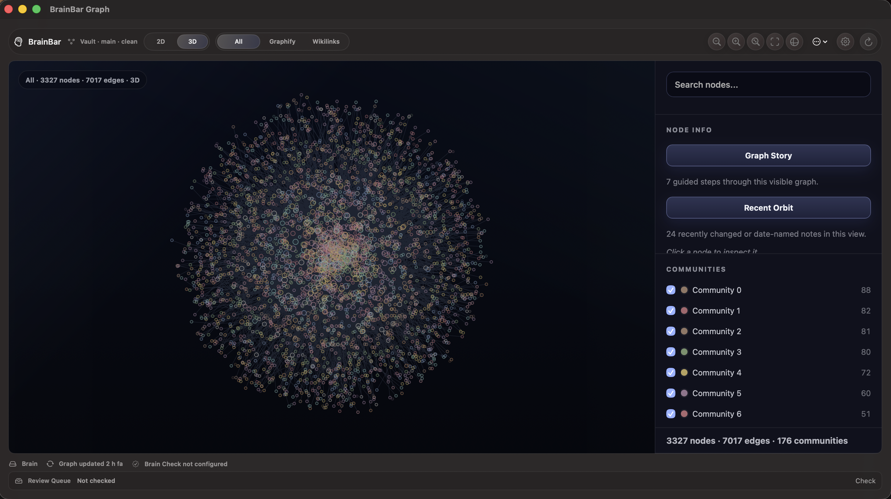
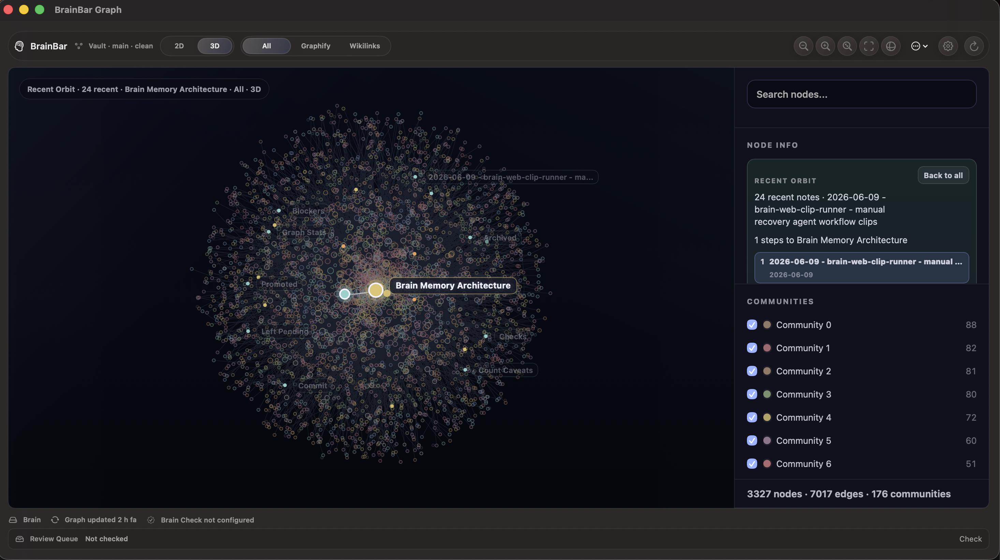
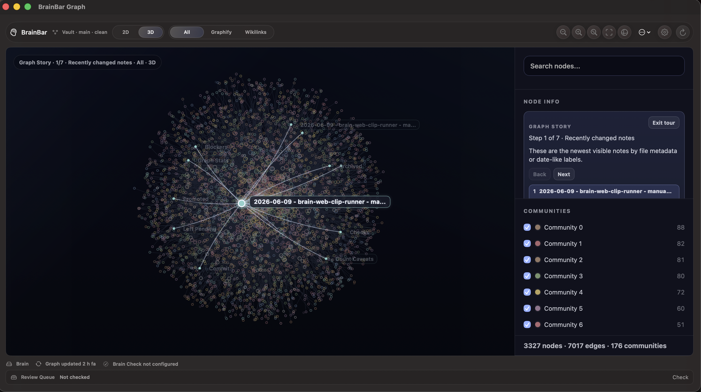
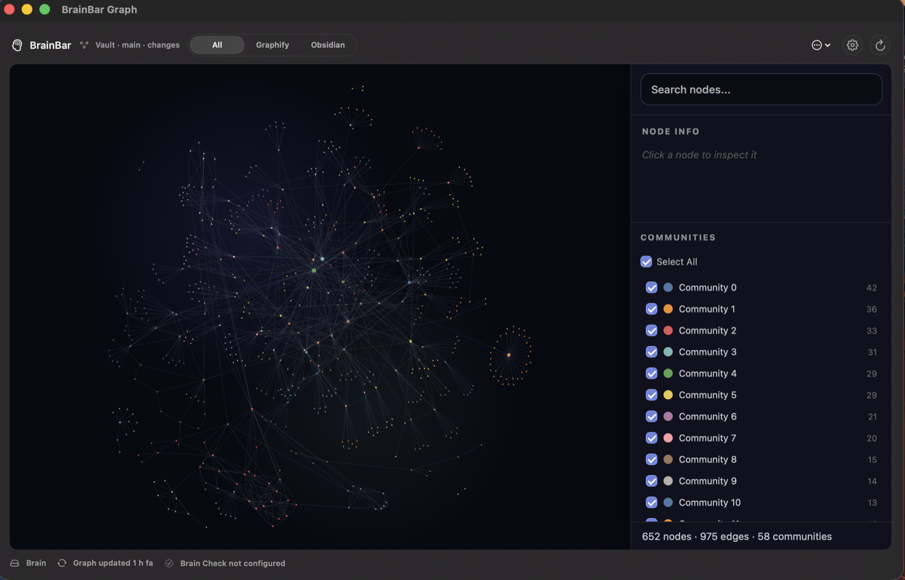
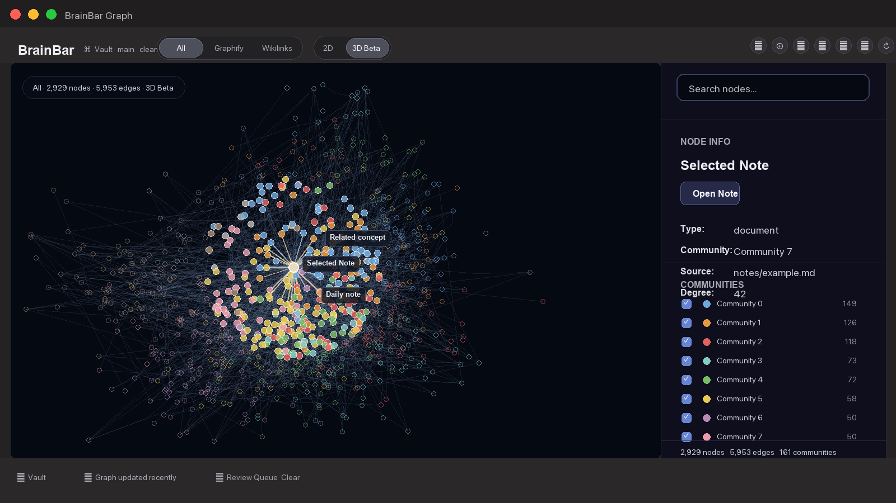
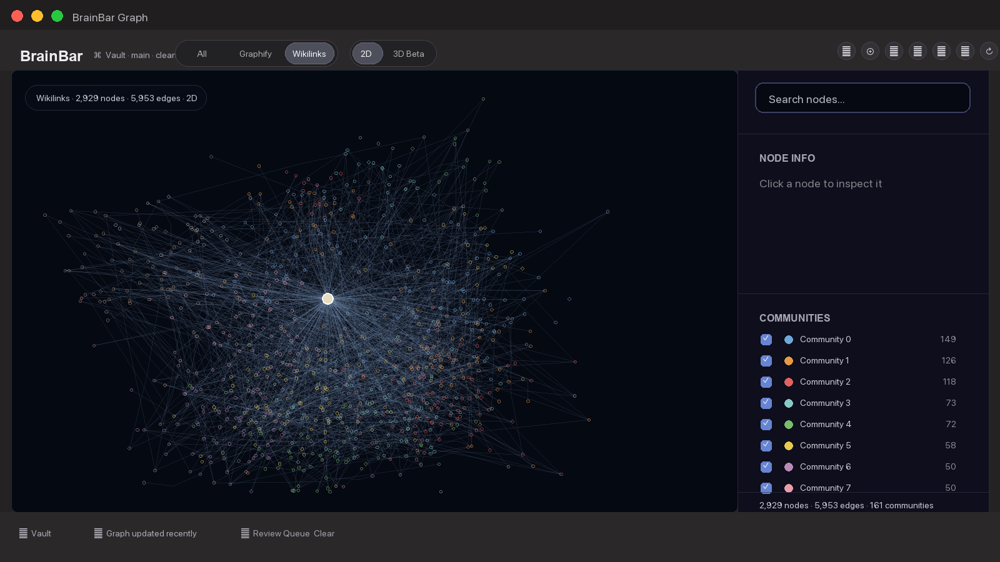

# BrainBar

> A local-first 3D control center for your Graphify-powered Markdown graph.

[](https://github.com/Nova1390/brain-bar/releases/latest)
[](https://www.apple.com/macos/)
[](https://developer.apple.com/xcode/swiftui/)
[](https://github.com/safishamsi/graphify)
[](LICENSE)

BrainBar turns local Graphify output into a native macOS workspace for exploring a second brain or any Markdown knowledge graph. Open a 3D map of your notes, search-reveal the right place, focus a single neighborhood, trace the shortest visible route between two ideas, explain why that route exists, and re-enter from what changed recently.

It is built for people who already keep useful things in local Markdown and want the graph to become an operating surface, not just a pretty hairball.



## What BrainBar Does

BrainBar reads existing Graphify output from a local Markdown vault or Graphify-compatible content folder. It does not generate the graph from scratch, vendor Graphify, upload vault content, or rewrite generated Graphify files.

Graph exploration features are runtime-only. Search Reveal, Focus, Source Lens, Shortest Path, Community Spotlight, Recent Orbit, Graph Story, and 2D graph views change the current app session; they do not write back to the vault.

## What Is In v0.9.6

- 3D Explorer with Focus Orbit and depth controls.
- Search Reveal for jumping from search results into the visible 3D graph and choosing path targets.
- Shortest Path, Explain Path, and Path Compare for visible graph routes.
- Community Spotlight for inspecting one visible community at a time.
- Recent Orbit for resuming from recently changed notes.
- Graph Story as a compact narrative tour through the visible graph.
- Living Graph polish: calm ambient breathing, recent-note warmth, edge currents, community breathing, and softened response pulses.
- 2D Workbench with operational graph views, Search Reveal, Focus, community detail, edge inspection, Graph Check, Source Lens, and 2D-to-3D bridge actions.
- Refined 2D Workbench visuals with a calmer map canvas, quieter global edges, clearer state highlights, and more consistent panels.
- Public GitHub Releases as Developer ID signed, Apple-notarized DMGs.

## Install

```sh
curl -fsSL https://raw.githubusercontent.com/Nova1390/brain-bar/main/install.sh | bash
```

The installer downloads the latest GitHub Release DMG, installs `BrainBar.app` into `~/Applications`, and preserves existing local config.

To prefill the vault path on first install:

```sh
BRAIN_BAR_VAULT_PATH="/path/to/your/vault" curl -fsSL https://raw.githubusercontent.com/Nova1390/brain-bar/main/install.sh | bash
```

To replace an existing install non-interactively:

```sh
BRAIN_BAR_FORCE=1 curl -fsSL https://raw.githubusercontent.com/Nova1390/brain-bar/main/install.sh | bash
```

Public releases from `v0.9.3` onward are Developer ID signed, Apple-notarized, stapled, packaged as `BrainBar.dmg`, and verified on a clean GitHub-hosted macOS runner.

## First Run

BrainBar expects Graphify output to already exist inside the configured vault.

1. Install or update [Graphify](https://github.com/safishamsi/graphify) separately.
2. Configure BrainBar with your local vault path, either in Settings or with `BRAIN_BAR_VAULT_PATH` during install.
3. Confirm the configured vault contains:

```text
graphify-out/
|-- graph.html
|-- graph.json
`-- GRAPH_REPORT.md
```

4. Open BrainBar from the menu bar.
5. Use Refresh Graph if the graph output is stale or missing.
6. Open the Focus Window and start with the 3D Explorer.

## The Wow Loop

1. Open BrainBar from the menu bar.
2. Switch to the 3D Explorer.
3. Search for a note and reveal it in place without collapsing the graph.
4. Use Focus to understand its neighborhood.
5. Start a path from one note, click another note or search result, and BrainBar traces the visible route.
6. Read Why this path, compare route variants, or use Recent Orbit and Graph Story to re-enter from recent work.


## Why BrainBar

- **A graph you can act on.** Search-reveal a node, open its source note, focus its neighbors, or start a path to another idea.
- **Local by default.** BrainBar reads local Graphify output and local source files. It does not upload vault content.
- **Paths with meaning.** Shortest Path, Explain Path, and Path Compare turn connections into readable context.
- **Recent context recovery.** Recent Orbit highlights newly changed notes and shows how they connect back to key notes.
- **Guided orientation.** Graph Story turns recent notes, key notes, large communities, bridge notes, and needs-attention areas into a compact narrative tour.
- **Diagnostics stay available.** 2D Workbench remains the operational surface for Recent Notes, Needs Links, Key Notes, Groups, Source Lens, and Graph Check.
- **No account required.** BrainBar is a local app over local files and local commands.

## 3D Explorer

The 3D Explorer is BrainBar's main human exploration surface. It keeps the whole graph visible, adds subtle ambient motion and response pulses, and gives you runtime-only modes for making one part understandable at a time.

### Focus Orbit

Click a note, then use `Focus`, `Depth 1`, `Depth 2`, or `Depth 3` to keep the selected note readable while surrounding context fades back. The sidebar shows the selected note, source path, degree, and top neighbors instead of an infinite wall of links.

### Search Reveal

Search in 3D jumps to visible matching notes instead of filtering the graph away. Pick a result to reveal that note, highlight its local neighborhood, and then use Focus or Start path from the sidebar. If `Start path` is already armed, clicking a search result uses that result as the path target.

### Shortest Path

Click a node, choose `Start path`, then click another node. BrainBar calculates the shortest visible unweighted path using the current Source Lens and community filters.

Path mode highlights the path, dims surrounding graph context, labels the route, and keeps ordered steps clickable in the sidebar.

### Explain Path

Under the path steps, BrainBar adds a deterministic `Why this path` explanation. It uses only visible graph metadata:

- Wikilink vs Graphify provenance
- communities crossed
- strongest bridge note in the route
- available edge labels
- conservative caveats when metadata is sparse

No AI, network call, or vault write is involved.

### Path Compare

When alternative routes exist, Path Compare can switch the same source and target between:

- `Shortest visible`
- `Different route`
- `Best explained`
- `Wikilinks only`
- `Graphify only`

If a variant is unavailable in the current view, BrainBar says so instead of pretending every pair has every kind of path.

Unavailable variants are normal when the visible graph has only one route, no route between the selected nodes, or active Source Lens/community filters hide the needed edges.

### Community Spotlight

Click a community to dim the rest of the graph, show the selected community, list top notes, and surface bridge notes that connect it to surrounding areas. Large communities use conservative render budgets so the spotlight stays responsive.

### Recent Orbit

Recent Orbit answers: "What changed recently?"

It highlights recent notes using file modification metadata when available, falls back to date-like labels or paths, and traces one active recent note to its nearest visible key note.

Use it when you want to resume from recent work and see how that work connects back to the graph.



### Graph Story

Graph Story is a guided, deterministic tour through the current visible graph. Each step appears as a compact story card with a primary note or community, a short takeaway, and a few supporting items instead of a long diagnostic list.

Current step types include:

- Recently changed notes
- Your most connected notes
- Largest visible communities
- Notes connecting communities
- Areas that may need links

The tour adapts to the current Source Lens and community filters. Empty categories are skipped, and actions such as `Focus note` or `Open note` appear only when the current step has a suitable note.

Use it when you want orientation: a short guided pass through what matters in the visible graph.



## 2D Workbench

2D is the stable embedded Graphify-powered workbench. BrainBar injects runtime JS/CSS to add inspection, search, focus, community detail, edge inspection, and graph-check controls without rewriting `graphify-out/graph.html`.



The 2D toolbar focuses on operational views:

- `Global`
- `Focus`
- `Recent Notes`
- `Key Notes`
- `Needs Links`
- `Groups`
- `Graph Check`

`Wikilinks` and `Graphify` live in the 2D `Source Lens` control so the workbench views stay focused on tasks rather than provenance toggles.

When Review Queue items expose `source_file` or `node_id`, a `Review` view can highlight them in the graph. If there are no graph-targeted review items, the button stays hidden.

From 2D, selected notes, edges, and communities can bridge into 3D with `Reveal in 3D`, `Path from here in 3D`, or community reveal actions.



## Source Lens

Source Lens filters edge provenance in the current graph view:

- `All`: show all visible graph relationships
- `Graphify`: show generated Graphify relationships
- `Wikilinks`: show wikilinks exported by Graphify metadata

The internal compatibility raw value for Wikilinks is still `obsidian`; the public label is `Wikilinks`.



## Local Workflow Control

BrainBar can also act as a small local command surface:

- Refresh Graphify output.
- Open Graphify report files.
- Show System Status for vault path, graph file, Graphify command, Git state, Review Queue, and Brain Check.
- Run an optional Brain Check command.
- Show an optional Review Queue status command.

Review Queue is deliberately generic. BrainBar reads a configured local JSON status command and can run an explicit manual action when clicked. The background watcher is off by default and only checks status.

## Graphify

BrainBar expects Graphify output in the configured vault:

```text
graphify-out/
|-- graph.html
|-- graph.json
`-- GRAPH_REPORT.md
```

BrainBar does not vendor, fork, or modify Graphify. It runs the configured local refresh command and embeds the generated files.

## Configuration

Default config path:

```text
~/Library/Application Support/BrainBar/config.json
```

Development and tests can override it:

```sh
BRAIN_BAR_CONFIG=/tmp/brainbar-config.json open ~/Applications/BrainBar.app
```

Installer variables:

- `BRAIN_BAR_VAULT_PATH`: prefill the configured local vault path.
- `BRAIN_BAR_FORCE=1`: replace an existing install non-interactively.
- `BRAIN_BAR_INSTALL_DIR`: override the install directory, defaulting to `~/Applications`.

See [Configuration](docs/configuration.md) for the full config shape and command behavior.

## Requirements

- macOS 14 or newer
- `graphify` available on `PATH` for the default refresh command, or a custom refresh command in config
- `git` available on `PATH` for Git status
- Xcode 26 or newer for local development

## Development

```sh
xcodebuild -project BrainBar.xcodeproj -scheme BrainBar -destination 'platform=macOS' build
xcodebuild test -project BrainBar.xcodeproj -scheme BrainBar -destination 'platform=macOS' CODE_SIGNING_ALLOWED=NO
node scripts/test-graph-runtime.mjs
scripts/check-public-safety.sh
```

Before changing product vocabulary or graph architecture terms, read [CONCEPTS.md](CONCEPTS.md).

## Release

Maintainer release tags publish a notarized `BrainBar.dmg` through GitHub Actions:

```sh
git tag -a vX.Y.Z -m "BrainBar vX.Y.Z"
git push origin vX.Y.Z
```

The release workflow runs public safety checks, graph runtime checks, Xcode tests, Developer ID signing, Apple notarization, stapling, DMG creation, and mounted-app validation before uploading the asset. Required and optional signing secrets are documented in [RELEASING.md](RELEASING.md).

After publication, maintainers can run the clean-runner verification workflow:

```sh
gh workflow run verify-release-dmg.yml --ref main -f tag=vX.Y.Z
```

## Update

Run the installer again. Existing config is preserved.

```sh
BRAIN_BAR_FORCE=1 curl -fsSL https://raw.githubusercontent.com/Nova1390/brain-bar/main/install.sh | bash
```

## Uninstall

```sh
curl -fsSL https://raw.githubusercontent.com/Nova1390/brain-bar/main/uninstall.sh | bash
```

To remove local config too:

```sh
BRAIN_BAR_REMOVE_CONFIG=1 curl -fsSL https://raw.githubusercontent.com/Nova1390/brain-bar/main/uninstall.sh | bash
```

## Troubleshooting

- **The graph is empty.** Check that `vaultPath` points at the intended vault and that `graphify-out/graph.json` exists there.
- **Refresh Graph fails.** Make sure `graphify` is available on `PATH`, or update the configured refresh command.
- **Search finds nothing.** Search Reveal only searches nodes visible under the current Source Lens and community filters.
- **No path found.** The selected nodes may be disconnected in the visible graph, or the active Source Lens/community filters may hide the route.
- **Recent Orbit is empty.** BrainBar needs file modification metadata or date-like labels/paths to identify recent notes.
- **macOS blocks the app.** Install the latest notarized DMG release instead of an older non-notarized build.

## Privacy

BrainBar is local-first:

- It reads local graph output and configured local source files.
- It opens local notes through macOS.
- It runs local commands that you configure.
- It does not upload vault content.
- It does not write to the vault from graph exploration features.
- It does not call remote AI services.

## License

MIT. See [LICENSE](LICENSE).
