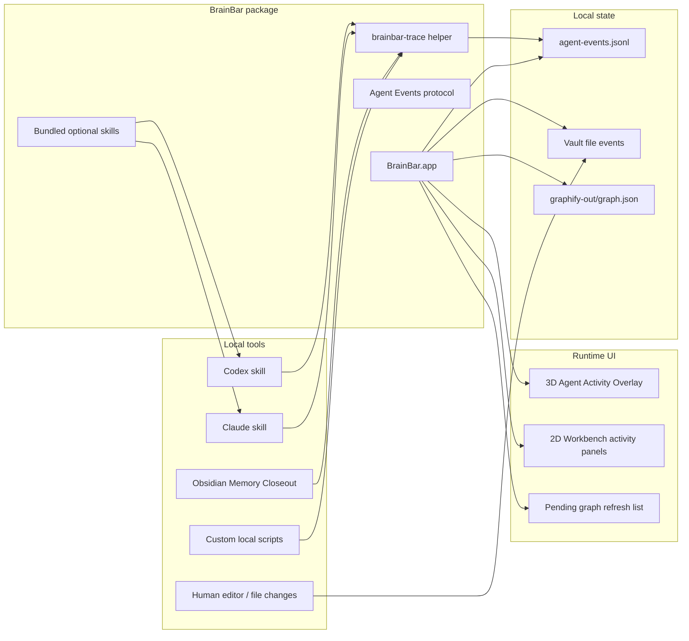

# BrainBar Agent Activity Architecture

## Purpose

Agent Activity is a proposed BrainBar capability for showing live work inside the graph: which notes are being read, written, created, refreshed, or used as context by local agents and workflows.

The goal is to make BrainBar feel like a local cockpit for graph-aware work without turning setup into a multi-tool checklist. BrainBar should remain the product users install. Agent skills and tracing helpers should be bundled and optional, not separate prerequisites.

This document defines the product architecture, event protocol, installation process, and rollout plan. It is public-safe and intentionally avoids private vault assumptions.

## Product Goal

BrainBar should answer:

- What changed in my local graph recently?
- What is an agent reading or writing right now?
- Which graph nodes were touched during this session?
- Which new notes are waiting for a graph refresh?
- How did the agent's work move through the graph?

The feature should be useful even without agent integrations. Agent-aware tracing should make it better, not required.

## Design Principles

- **BrainBar-first install**: users install BrainBar once; optional agent integrations are enabled from BrainBar onboarding or Settings.
- **Zero-config baseline**: BrainBar can show recent file activity from local file events and Git state without requiring agent skills.
- **Optional structured tracing**: compatible agents can emit BrainBar Agent Events for richer read/write/focus visibility.
- **One shared protocol**: Codex, Claude, Obsidian Memory Closeout, custom scripts, and future tools should all write the same event format.
- **Metadata only**: events record paths, actions, timestamps, tool identity, and optional session ids; they must not store note contents, prompts, secrets, or raw transcripts.
- **Runtime-first visualization**: graph overlays are session/runtime state. They should not mutate vault files or generated Graphify output.
- **Graceful absence**: if no agent events exist, BrainBar should not show setup errors or empty complexity.

## Architecture Overview



BrainBar owns:

- event schema;
- local event log location;
- bundled helper CLI;
- optional skill templates/installers;
- event-to-node mapping;
- graph overlays and panels.

External agents own:

- when to emit events;
- whether they can distinguish read/write/focus operations;
- optional richer workflow event types.

## Package Shape

BrainBar can ship all integration assets inside the app bundle:

```text
BrainBar.app/
`-- Contents/
    `-- Resources/
        |-- AgentIntegrations/
        |   |-- Codex/
        |   |   `-- brainbar-agent-trace/
        |   |-- Claude/
        |   |   `-- brainbar-agent-trace/
        |   `-- ObsidianMemoryCloseout/
        |       `-- integration-notes.md
        `-- bin/
            `-- brainbar-trace
```

The user-facing install flow should be:

1. Install BrainBar.
2. Open Settings.
3. Choose `Enable Agent Activity`.
4. BrainBar detects supported local agent environments.
5. User enables integrations with one click per tool:
   - `Install Codex integration`
   - `Install Claude integration`
   - `Enable Memory Closeout tracing`
6. BrainBar verifies that events can be written and read.

This avoids asking the user to manually install multiple skills before BrainBar becomes useful.

## Zero-Config Baseline

Agent Activity should work at a basic level without any agent skill:

- Watch configured vault files for create/modify/delete events.
- Reuse existing recent metadata logic.
- Optionally compare Git status to identify touched files.
- Map changed paths to graph nodes when possible.
- Show pending changes that do not yet exist in `graph.json`.

Baseline UI:

- `Recent file activity`;
- `Changed since last graph refresh`;
- `New files not yet in graph`;
- `Refresh Graph` call to action.

This is not agent-aware, but it already makes the graph feel live.

## Agent Event Protocol

Events are newline-delimited JSON. One event per line.

Default location:

```text
~/Library/Application Support/BrainBar/agent-events.jsonl
```

Optional project-local location:

```text
<vault>/.brainbar/agent-events.jsonl
```

BrainBar should read both locations if present, with user-visible controls for enabling project-local event logs.

### Minimal Event

```json
{
  "version": 1,
  "agent": "codex",
  "action": "read",
  "path": "05_Sessions/example.md",
  "timestamp": "2026-06-11T13:00:00Z"
}
```

### Recommended Event

```json
{
  "version": 1,
  "agent": "codex",
  "action": "write",
  "path": "04_Decisions/example.md",
  "timestamp": "2026-06-11T13:00:00Z",
  "session_id": "local-session-123",
  "project": "local-vault",
  "source": "brainbar-agent-trace",
  "reason": "closeout"
}
```

### Supported Actions

- `read`: a file was used as context.
- `write`: a file was modified.
- `create`: a file was created.
- `delete`: a file was removed.
- `focus`: the agent is currently centered on this file or concept.
- `open`: a local tool opened the file.
- `graph_refresh`: graph output was refreshed.
- `closeout`: a workflow wrote a session/project closeout.
- `decision`: a workflow wrote or updated a decision record.

Unknown actions should be ignored or shown as generic `activity`.

### Required Fields

- `version`
- `agent`
- `action`
- `path`
- `timestamp`

### Optional Fields

- `session_id`
- `project`
- `source`
- `reason`
- `node_id`
- `vault_id`
- `duration_ms`
- `status`

Optional fields must never be required for the overlay to work.

## Helper CLI

BrainBar should bundle a small helper named `brainbar-trace`.

Example usage:

```sh
brainbar-trace read 05_Sessions/example.md
brainbar-trace write 04_Decisions/example.md --reason closeout
brainbar-trace focus 02_Areas/example.md --session local-session-123
brainbar-trace graph-refresh
```

Responsibilities:

- Normalize paths.
- Avoid writing content.
- Append a single JSONL event.
- Create the event directory if needed.
- Use atomic append semantics where practical.
- Return non-zero only for real write failures.

The helper should be boring and stable. Agent skills should call it instead of reimplementing JSON writing.

## Optional Skills

### Codex Integration

BrainBar can install a Codex skill that tells Codex:

- call `brainbar-trace read <path>` when using a source note as meaningful context;
- call `brainbar-trace write <path>` after creating or changing a relevant note;
- call `brainbar-trace focus <path>` when a task has a clear active note;
- do not emit events for secrets, raw transcripts, temp files, build artifacts, or unrelated repo files;
- prefer relative paths inside the configured vault.

The skill should be small and operational. It should not duplicate BrainBar product docs.

### Claude Integration

Claude integration should use the same protocol and helper. The installation target may differ, but the emitted events must be identical.

### Obsidian Memory Closeout Integration

Obsidian Memory Closeout should be treated as a producer of richer workflow events, not a required dependency.

Potential event mapping:

- read required context notes -> `read`
- write session summary -> `closeout`
- create decision note -> `decision`
- update project note -> `write`
- run graph refresh -> `graph_refresh`

This keeps Memory Closeout useful without making BrainBar depend on it.

## BrainBar Runtime Mapping

BrainBar maps event paths to graph nodes using:

1. direct `node_id`, when provided;
2. `source_file` or Graphify metadata path;
3. normalized relative path;
4. filename stem fallback;
5. pending state if no graph node exists yet.

If no graph node exists:

- keep the event in `Pending graph refresh`;
- show the path in a compact list;
- offer `Refresh Graph`;
- map it after the next graph refresh if Graphify emits a matching node.

## Visual Model

3D should be the primary surface for live activity.

Suggested visual states:

- `read`: cool blue glow.
- `write`: warm amber glow.
- `create`: green ring.
- `focus`: stronger ring plus subtle pulse.
- `closeout` / `decision`: warm structured marker.
- `graph_refresh`: brief graph-level pulse or HUD status.

Budgets:

- show active events from the last 30-120 seconds;
- keep a trail of the last 20-50 mapped events;
- cap labels aggressively;
- never animate every event in large graphs;
- respect reduced-motion preferences.

2D Workbench can expose:

- recent agent activity list;
- event details for a selected node;
- pending unmapped paths;
- actions: `Reveal in 3D`, `Open Note`, `Refresh Graph`.

## User Experience

### Onboarding

Suggested copy:

> BrainBar can show live local activity in your graph. It works from file changes out of the box. Optional agent integrations can show what compatible tools are reading and writing.

Buttons:

- `Enable Agent Activity`
- `Install Codex Integration`
- `Install Claude Integration`
- `Skip for now`

### Settings

Settings should show:

- Agent Activity enabled/disabled.
- Event log location.
- Last event timestamp.
- Detected integrations.
- Install/uninstall buttons for bundled integrations.
- Privacy note: metadata only, no note contents.

### Empty States

- No events yet: “Activity will appear here when files change or compatible agents emit events.”
- Events but no graph node: “Some activity is not in the graph yet. Refresh Graph after the source files are ready.”
- Helper not installed: “BrainBar can still use file activity. Install an agent integration for read/write traces.”

## Privacy And Safety

BrainBar should never store:

- note contents;
- prompts;
- raw transcripts;
- credentials;
- API keys;
- personal contact data;
- arbitrary command output.

Event logs should contain only:

- action;
- local relative path;
- timestamp;
- tool identity;
- optional session/workflow metadata.

Project-local logs should be opt-in because they may be committed accidentally. If enabled, BrainBar should offer to add `.brainbar/agent-events.jsonl` to `.gitignore` when the configured vault is a Git repo.

## Implementation Phases

### Phase 1: File Activity Overlay

No agent integrations yet.

- Watch vault file create/modify/delete events.
- Map paths to graph nodes.
- Show 3D activity overlay and pending refresh list.
- Add Settings toggle.
- Keep all state runtime/session-only.

### Phase 2: Event Protocol And Helper

- Add `brainbar-trace`.
- Define JSONL parser and validator.
- Read global event log.
- Map events to nodes.
- Add 3D event overlay and 2D activity detail panel.

### Phase 3: Bundled Codex Integration

- Ship a Codex skill template in the app bundle.
- Add one-click installer from Settings.
- Verify events by writing a test event.
- Document uninstall.

### Phase 4: Claude Integration

- Ship a Claude-compatible integration template.
- Keep event protocol identical.
- Add detection/install/verify flow.

### Phase 5: Memory Closeout Integration

- Add optional Memory Closeout tracing instructions or helper hooks.
- Emit richer workflow actions such as `closeout`, `decision`, and `graph_refresh`.
- Keep integration optional and protocol-based.

## Acceptance Criteria

- Installing BrainBar alone is enough to see recent local file activity.
- Agent integrations can be enabled from BrainBar without manual copy/paste setup.
- Event logs never contain note contents.
- Events map to graph nodes when possible and degrade to pending paths when not.
- 3D overlays remain readable on large graphs.
- 2D Workbench exposes enough event detail for inspection without becoming the main live surface.
- Missing integrations never break normal BrainBar usage.

## Open Questions

- Should project-local event logs be supported in the first agent-aware release, or should v1 use only the global Application Support log?
- Should BrainBar own installation into Codex/Claude config folders directly, or export integration files for user review first?
- How long should live activity remain visible by default: 30 seconds, 2 minutes, or session-long trail?
- Should `read` events be emitted only for durable context reads, or also for quick file inspections?
- Should event logs rotate automatically by size, by day, or by session?
